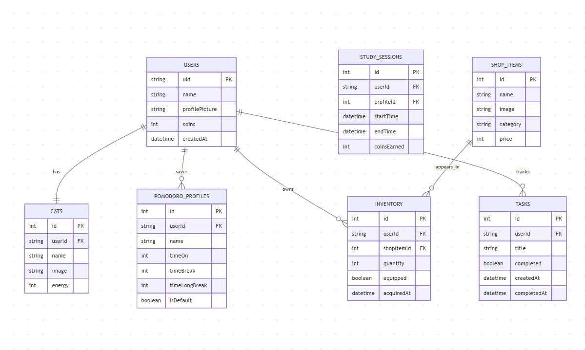

# Entity Relationship Diagram

Reference the Creating an Entity Relationship Diagram final project guide in the course portal for more information about how to complete this deliverable.

## Create the List of Tables

<!-- *[👉🏾👉🏾👉🏾 List each table in your diagram]* -->
* USERS
* CATS
* POMODORO_PROFILES
* INVENTORY
* SHOP_ITEMS
* TASKS

## Add the Entity Relationship Diagram

<!-- [👉🏾👉🏾👉🏾 Include an image or images of the diagram below. You may also wish to use the following markdown syntax to outline each table, as per your preference.]

| Column Name | Type | Description |
|-------------|------|-------------|
| id | integer | primary key |
| name | text | name of the shoe model |
| ... | ... | ... | -->



---
```
erDiagram
  USERS {
    string uid PK
    string name
    string profilePicture
    int coins
    datetime createdAt
  }

  CATS {
    int id PK
    string userId FK
    string name
    string image
    int energy
  }

  POMODORO_PROFILES {
    int id PK
    string userId FK
    string name
    int timeOn
    int timeBreak
    int timeLongBreak
    boolean isDefault
  }

  STUDY_SESSIONS {
    int id PK
    string userId FK
    int profileId FK
    datetime startTime
    datetime endTime
    int coinsEarned
  }

  SHOP_ITEMS {
    int id PK
    string name
    string image
    string category
    int price
  }

  INVENTORY {
    int id PK
    string userId FK
    int shopItemId FK
    int quantity
    boolean equipped
    datetime acquiredAt
  }

  TASKS {
    int id PK
    string userId FK
    string title
    boolean completed
    datetime createdAt
    datetime completedAt
  }

  %% Relationships
  USERS ||--|| CATS : has
  USERS ||--o{ POMODORO_PROFILES : saves
  USERS ||--o{ INVENTORY : owns
  SHOP_ITEMS ||--o{ INVENTORY : appears_in
  USERS ||--o{ TASKS : tracks

%% || = exactly one
%% o{ = zero or many
%% |{ = one or many
%% o| = zero or one
%% PK = Primary Key
%% FK = Foreign Key
```
